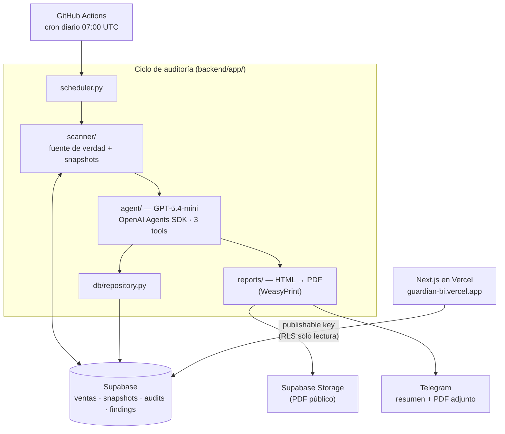

# Dashboard Guardian

[](https://github.com/joakinalvaws/GuardianBI/actions/workflows/scheduler.yml)

Agente de inteligencia operacional que audita dashboards de Power BI de forma autónoma.

Detecta tres tipos de problemas que cuestan dinero y nadie nota a tiempo:

1. **Datos desactualizados** — métricas que llevan días sin cargarse
2. **Métricas inconsistentes** — el dashboard dice una cosa, la fuente de datos otra
3. **Conflictos entre reportes** — la misma métrica con valores distintos en dos reportes

Cuando encuentra algo, genera un informe PDF con severidad y causa probable en lenguaje
natural, y lo envía por Telegram. Solo notifica cuando hay algo relevante.

**Web en producción:** [guardian-bi.vercel.app](https://guardian-bi.vercel.app) —
historial de auditorías con drill-down por hallazgo y por métrica.

## Arquitectura



El agente usa el **OpenAI Agents SDK** con tool use real: `detect_stale_data`,
`check_metric_consistency` y `compare_cross_reports`. Cada tool consulta
Supabase en vivo y el agente clasifica severidad y redacta causa probable
y recomendación como salida estructurada (Pydantic).

## Stack

| Capa | Tecnología |
|---|---|
| Agente IA | GPT-5.4-mini + OpenAI Agents SDK |
| Backend | Python 3.12 + FastAPI |
| Base de datos | Supabase (PostgreSQL + Storage) |
| PDF | WeasyPrint |
| Notificaciones | Telegram Bot API |
| Frontend | Next.js 16 + Tailwind, deploy en Vercel |
| Scheduler | GitHub Actions (cron diario) |

## Setup rápido

```bash
# 1. Entorno
python3 -m venv backend/venv
source backend/venv/bin/activate
pip install -r backend/requirements.txt

# 2. Credenciales
cp backend/.env.example backend/.env   # y rellena los valores reales

# 3. Verificar conexiones
python backend/scripts/check_supabase.py
python backend/scripts/check_openai.py
python backend/scripts/check_telegram.py

# 4. Base de datos: ejecutar en el SQL Editor de Supabase
#    backend/db/schema.sql    (tablas)
#    backend/db/policies.sql  (RLS de solo lectura para la web)

# 5. Datos de prueba
python backend/scripts/seed_data.py
python backend/scripts/inject_errors.py --all     # romper datos a propósito
python backend/scripts/inject_errors.py --reset   # volver a estado limpio

# 6. Auditoría completa (scanner → agente → PDF → Storage → Telegram)
cd backend && python -m app.scheduler --run-now

# 7. Tests
cd backend && pytest tests/ -v

# 8. Web app
cd frontend && cp .env.example .env.local   # URL + publishable key
npm install && npm run dev
```

## Power BI en producción

El MVP audita una simulación de dashboards (`dashboard_snapshots`) para ser
demostrable sin licencias de Microsoft. La integración con Power BI real está
lista para enchufarse: el cliente (`backend/app/scanner/powerbi_client.py`,
service principal + DAX vía `executeQueries`) y la guía de adopción paso a
paso en [`docs/powerbi-production.md`](docs/powerbi-production.md). La
decisión está documentada en el
[ADR-005](docs/adr/005-power-bi-como-ruta-de-produccion.md).

## Documentación

- Plan completo, fases y criterios de salida: [`dashboard-guardian-plan.md`](dashboard-guardian-plan.md)
- Decisiones de arquitectura: [`docs/adr/`](docs/adr/)
- Guía de adopción con Power BI real: [`docs/powerbi-production.md`](docs/powerbi-production.md)
